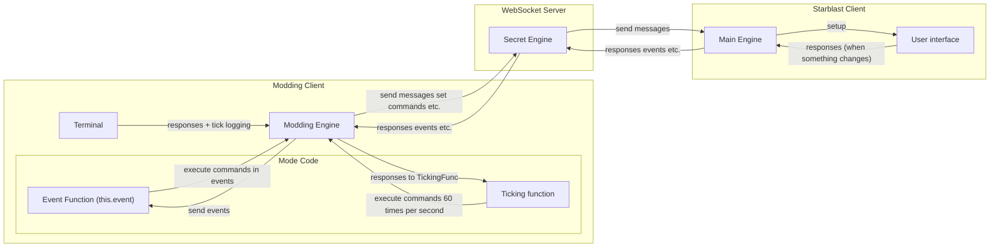

# Modding Documentation

```mermaid
---
config:
  layout: fixed
---
flowchart LR
 subgraph ModdingClient["Modding Client"]
        ModCode["Mod code"]
        subgraph ModCode["Mode Code"]
        EventFunc["Event Function (this.event)"]
        TickingFunc["Ticking Function (this.tick)"]
        end
        
        TickingFunc["Ticking function"]
        ModdingEngine["Modding Engine"]
        Terminal["Terminal"]
  end
 subgraph WebSocketServer["WebSocket Server"]
        SecretEngine["Secret Engine"]
  end
 subgraph StarblastClient["Starblast Client"]
        UserInterface["User interface"]
        MainEngine["Main Engine"]
  end
    EventFunc -- execute commands in events --> ModdingEngine
    TickingFunc -- execute commands 60 times per second --> ModdingEngine
    ModdingEngine -- send events --> EventFunc
    ModdingEngine -- responses to TickingFunc --> TickingFunc
    Terminal -- responses + tick logging --> ModdingEngine
    UserInterface -- responses (when something changes) --> MainEngine
    MainEngine -- setup --> UserInterface
    ModdingEngine -- "send messages set commands etc." --> SecretEngine
    SecretEngine -- "responses events etc." --> ModdingEngine
    SecretEngine -- send messages --> MainEngine
    MainEngine -- "responses events etc." --> SecretEngine    
```

