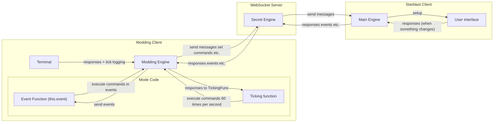

# About

A project by [@rithyn](https://github.com/rithyn) to produce a high-performance, user-friendly documentation tool.
Free feel to report any issues/feedbacks or contribute to the project.

## Starblast Modding :

